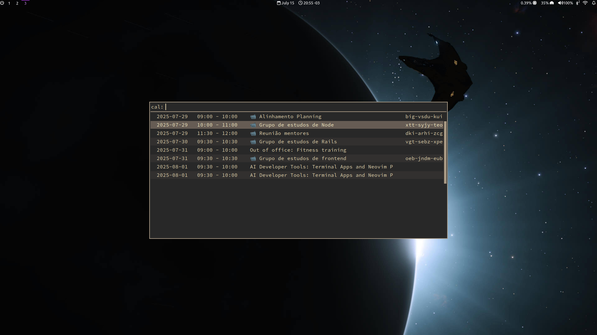

# Rofi Google Calendar

A [rofi] script to show events from Google Calendar and open details or events.



Loosely based on https://www.reddit.com/r/unixporn/comments/oin3qg/oc_timetablecalendar_setup_with_rofi/.

## Preliminary setup

1. Follow Instructions from the [Python quickstart page]
    - Enable the API (select or create a project)
    - Configure the OAuth consent screen
    - Authorize credentials for a desktop application
2. Save the client secret file to `~/.config/rofi-calendar/credentials.json`
3. Ask to "See all events details" on the calendars to read (listed in `settings.yml`)

## Setup and usage

```bash
# Copy and fill settings file
cp settings.yml.sample ~/.config/rofi-calendar/settings.yml

# Create and activate virtual env
python -m venv .venv
source .venv/bin/activate

# Install dependencies
pip install -r requirements.txt

# Run the script with rofi
rofi -show cal -modes "cal:bin/rofi-calendar"
```

## Features

Existing and planned features.

- [ ] Package and Install as a Rofi plugin
- [x] Read events from Google Calendar
- [x] Open Meet conferences on default browser
- [ ] Open Zoom conferences on default browser or Zoom app
- [ ] Support multiple Google/Calendar Accounts

[Python quickstart page]: https://developers.google.com/calendar/api/quickstart/python
[rofi]: https://github.com/davatorium/rofi
